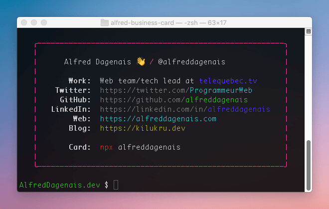

# This is my nerdy business card 🤓

It's me, Alfred!

## Screenshot



## Usage

```bash
npx alfreddagenais
```

Not including how to use it globally because I'm not sure why you'd want this as a global command. That'd be creepy.

## Credit

Forked from [@bitandbang](https://github.com/bnb/bitandbang)
